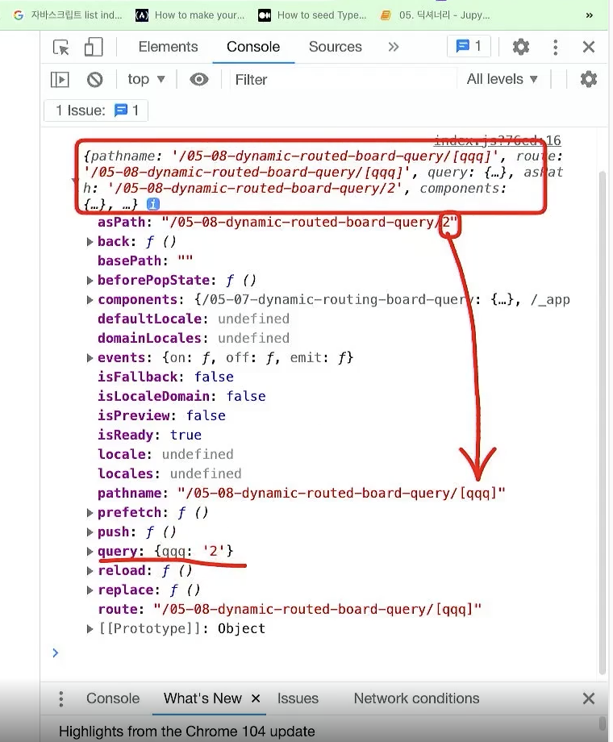

정적으로 pages폴더에 페이지를 담당하는 페이지를 여러개 만들지 말고   

동적으로 라우팅 처리할 수 있는 방법을 배운다.   

router를 콘솔로 찍어서

aspath
back
pathname
route 등이 뭔지 알아보자

위 그림에서 볼 수 있듯이   
동적 라우팅을 처리할때 aspath의 경우 실제 주소(url)를 의미하고
pathname의 경우 next 상에서  폴더 주소를 의미한다.

next 프로젝트에서 폴더 명을 [폴더명] 이런 식으로 처리해면   
폴더명이 변수처리 되어서 query에 들어가게 된다.

05-09 페이지에서 try catch 문으로 프론트에서 실수를 안해도 백엔드에서 발생할 수 있는 오류를   
사전에 처리한다.