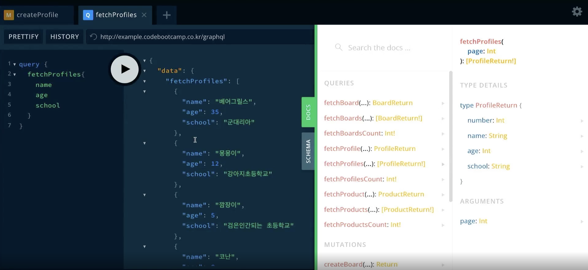

# graphQL에서 Mutation 작성법
    mutation {   
        createProfile(name: "서태웅", age: 17 , school: "북산고등학교"){
        _id
        number
        message
        }
    }

### 작성 예시
 

# graphQL에서 Query 작성법

    query {
        fetchProfiles{
        name
        age
        school
        }
    }
<strong>query를 보낼 때애는 반드시 한가지 이상 값을 보내야 한다.</strong>
### 작성 예시

<strong style='color:red'>fetchProfilesCount 같이 int! 처럼 "!"가 있으면 무조건 기입해줘야 한다.  </strong>